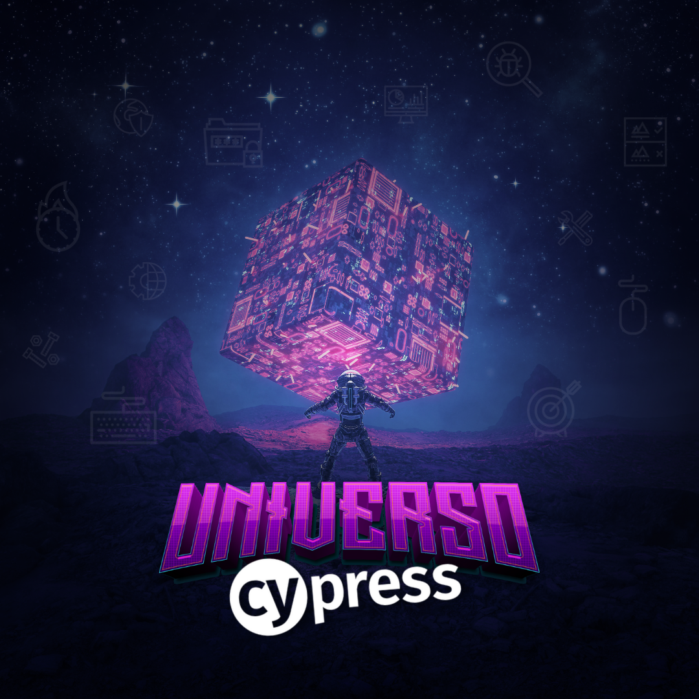
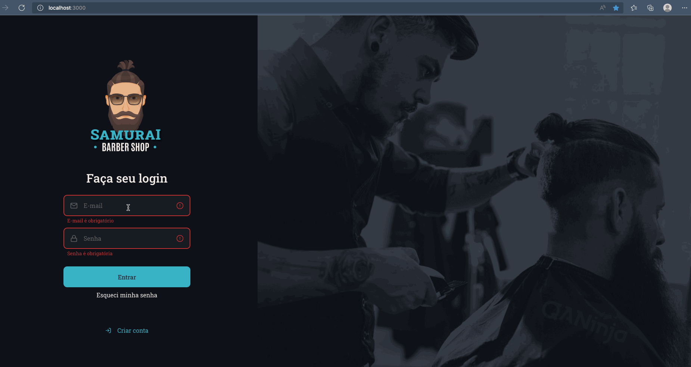

<h1 align="center">
    
    <br>
</h1>

<h2 align="center">
  <a href="https://github.com/DicoMonteiro/samuraibs-universo-cypress/tree/main/cypress/integration">Frontend</a>
</h2>

<h4 align="center">
  It's an app for waste collection created during <a href="https://pages.qa.ninja/universo-cypress">Universo Cypress</a>
  <br>
  Created with :purple_heart: :icon-heart:  by <a href="https://qa.ninja/">QANinja</a>
</h4>

## :video_camera: Demonstration

#### Automation Front-end

## Samurai Barbershop
<h2 align="center">
  
</h2>

## :rocket: Technologies

#### Automation Front-end

-  [Cypress](https://www.cypress.io/)
  
#### Automation Back-end

-  [Cypress](https://www.cypress.io/)

## :information_source: How To Prepare

To clone and run this application, you'll need [Git](https://git-scm.com). Follow the instructions:

### Pré-conditions ###

```bash
[x] Install Node.js 14.18 or over
[x] Install Yarn
[x] Install Git
[x] Clone this repository: git clone https://github.com/DicoMonteiro/samuraibs-universo-cypress
[x] Execute the command: yarn
```

## :information_source: How To Execute Tests

```bash
    [x] For test frontend:
        yarn test:e2e

    [x] For test frontend in headless:
        yarn test:headless

```

## :memo: License
This project is under the MIT license. See the [LICENSE](https://github.com/DicoMonteiro/course_devTester/LICENSE) for more information.

---

Made with :purple_heart:  by Adriano Almeida :wave:  [Get in touch!](https://www.linkedin.com/in/adriano-barreto-monteiro-almeida/)

[vc]: https://code.visualstudio.com/